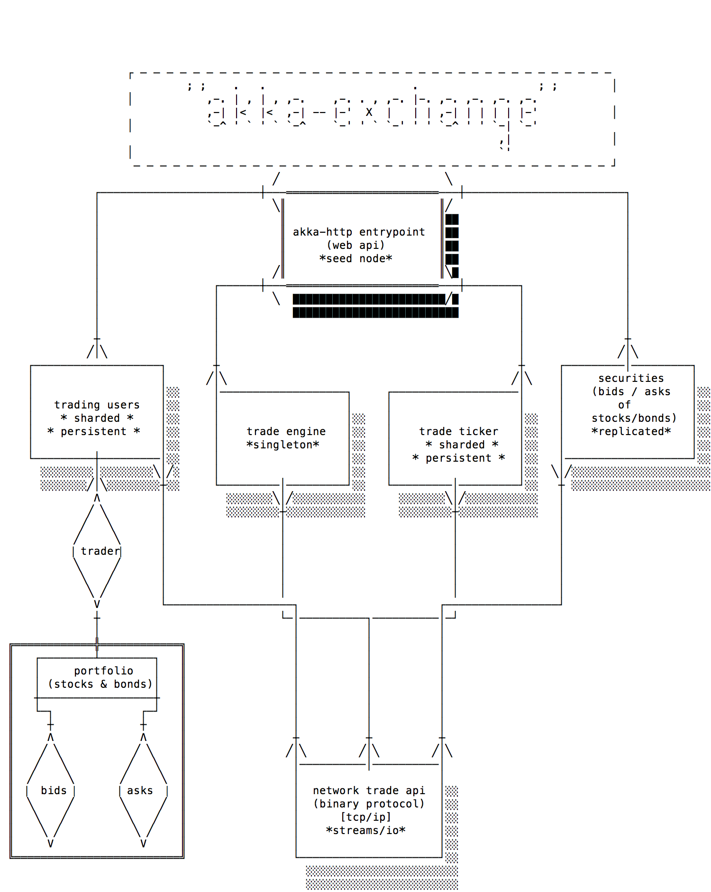

# akka-exchange
A demonstration multi-node Clustered Akka application including Spray, Sharding, Data Duplication (aka Replication), and Akka TCP / Streams.

This document outlines the design and usage of the project.

  * [System Design](#system-design)
    - [Architecture Overview](#architecture)

## System Design

The design of the system is to look sort of like a real live online trading exchange. Users are able to trade via both a Web interface; for larger customers such as banks a TCP/IP trade protocol is also provided.

Two types of security are tradeable:
  - Stocks 
    * Identifier: [Ticker Symbol](https://en.wikipedia.org/wiki/Ticker_symbol)
    * Exchange Type: i.e., FTSE, NYSE, NASDAQ, etc.
  - Bonds 
    * Identifier: [CUSIP](https://en.wikipedia.org/wiki/CUSIP)
    * Bond Type: i.e., Municipal, Corporate, Treasury, etc

### Architecture
The overall architecture is outlined roughly in the following diagram. Specific detail is found within.

The system utilizes Akka clustering, and is broken into several components. Each of the cluster nodes, uses several plugins which demonstrate various Akka Clustering features.

  - [Frontend Node](#frontend): The Rest API [akka-http / seed node(s)]
  - [Trade Ticker Node](#trading-users): Replicated Feed of completed trades/current prices. Utilizes Data Distribution (aka replication)
  - [Trading Users DB](#trading-users): Sharded Database of active users and their portfolios. Utilizes Sharding & Persistence.
  - [Securities DB Node](#securities): Sharded Database of known Securities, i.e. Stocks & Bonds. Utilizes Sharding & Persistence.
  - [Network Trade API](#network-trade-api): Network API for Trading, using a Binary Protocol. Utilizes Akka IO and Akka Streams for the sample client.

##### Notes
  - *TODO: Figure out where trade transactions are handled. Probably a FSM fired up per trade request?*
  - *TODO: `AtLeastOnceDelivery` to ensure a crash can recover a trade? Trade timeouts probably won't tolerate this but need an excuse to demo it.*

#### Frontend
The **frontend** of the system is a node running [akka-http](http://doc.akka.io/docs/akka-stream-and-http-experimental/1.0/scala/http/)1 ,  exposing a REST API for web users to trade, browse offerings, etc. This node (or nodes, if you choose to run multiple to load balance, etc) also acts as seed(s) for the cluster. With the default run scripts, the first **frontend** node will start on port `2551`.

<small>1</small>(note that performance is still not optimised for akka-http, but will be in future releases. Alternately we could use the highly performant Spray, upon which akka-http is based.)

#### Trade Ticker
An ephemeral (i.e. reboots/crashes of all Trade Ticker nodes will lose the data) node of Trade Data. This is a Replicated Feed of completed trades/current prices. 

Utilizes [Akka's Data Distribution](http://doc.akka.io/docs/akka/2.4.0-RC1/scala/distributed-data.html) module for Replication, so that there's a "Primary" instance of the Trade Ticker actor, with additional nodes acting as "Secondaries" consuming data. If the Primary node crashes/is shut down, the Secondary node takes over with the replicated data.

#### Trading Users 
Sharded Database of active users and their portfolios. Sharded for resource balancing, and Persistent, so it is tolerant to crash/shutdown/actor migration. 

Utilizes [Akka Sharding](http://doc.akka.io/docs/akka/2.4.0-RC1/scala/cluster-sharding.html) to spread out data & reduce single node resource usage. Additionally, uses [Akka Persistence](http://doc.akka.io/docs/akka/2.4.0-RC1/scala/persistence.html) to ensure tolerance to crash/failure/actor migration without losing User data.

- Each Trading User has a sub-actor for their portfolio, with a subactor for each security type. So, each user will have a child Portfolio Actor, each of which has child actors for Stock Portfolio and Bond Portfolio. *(TODO: maybe should be a trader has a StockPortfolio and BondPortfolio?)*

#### Securities 

Sharded Database of known Securities, i.e. Stocks & Bonds. This is all of the Securities active in the system, with information on every bid offer, and trade that has occurred. Sharded for resource balancing, and Persistent, so it is tolerant to crash/shutdown/actor migration.

Utilizes [Akka Sharding](http://doc.akka.io/docs/akka/2.4.0-RC1/scala/cluster-sharding.html) to spread out data & reduce single node resource usage. Additionally, uses [Akka Persistence](http://doc.akka.io/docs/akka/2.4.0-RC1/scala/persistence.html) to ensure tolerance to crash/failure/actor migration without losing User data.

#### Network Trade API 

Network based Trade System (TCP/IP with custom Binary Protocol) for emulating non-web users, such as large banks or high frequency traders. 

This utilizes [Akka I/O](http://doc.akka.io/docs/akka/2.4.0-RC1/scala/io.html) to handle the TCP/IP and serializing/deserializing of the messages. Interfaces to the system through the same Actor messaging as the REST API.

